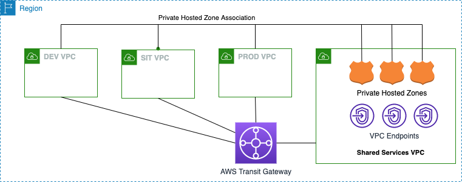

# About the Solution

Although Interface Endpoints scale more cleanly as the number of services increases, they introduce another scaling problem that makes the previous approach of deploying per-VPC impracticable: there's a small fee for each Endpoint of 1 cent per AZ per hour. For example if you were to deploy Interface Endpoints for all of the supported services (currently over 50) across 3 AZs in say 20 VPCs, the cost would be $(0.01 x 50 x 3 x 20) = $30/hr or over $20,000/month!

# what resources will be created with this solution:
- From the the account that has the shared VPC we run terraform code which will create the following resources:
**Note** We assume VPCs including Shared VPC and TGW are already existing. 
    1. Create the interface VPC endpoint in Shared Services VPC
    2. Turn off the private DNS when you create the endpoint.
    3. Create a Private Hosted zone with the same name as your endpoint (ex: ec2.amazonaws.com). This will give you full control over PHZ

- Now we need to
    1. Associate your Private Hosted Zone(PHZ) with your other account(s), This way you will be able to resolve to the private IPs of the VPC endpoints
    2. Make sure you have correct routing through Subnets and security groups

# Integrating AWS Transit Gateway with AWS PrivateLink and Amazon Route 53 Resolver
I want to take some time to dive more deeply into a use case outlined in NET301 Best Practices for AWS PrivateLink. The use case involves using AWS Transit Gateway, along with Amazon Route 53 Resolver, to share AWS PrivateLink interface endpoints between multiple connected Amazon virtual private clouds (VPCs) and an on-premises environment. We’ve seen a lot of interest from customers in this architecture. It can greatly reduce the number of VPC endpoints, simplify VPC endpoint deployment, and help cost-optimize when deploying at scale.

Architecture overview
For VPC endpoints that you use to connect to endpoint services (services you create using AWS PrivateLink behind a Network Load Balancer) the architecture is fairly straightforward. Since the DNS entries for the VPC endpoint are public, you just need layer-three connectivity between a VPC and its destination using either VPC peering, transit gateway, or a VPN. Where the architecture becomes more complex is when you want to share endpoints for AWS services and AWS PrivateLink SaaS.

When you create a VPC endpoint to an AWS service or AWS PrivateLink SaaS, you can enable Private DNS. When enabled, the setting creates an AWS managed Route 53 private hosted zone (PHZ) for you. The managed PHZ works great for resolving the DNS name within a VPC however, it does not work outside of the VPC. This is where PHZ sharing and Route 53 Resolver come into play to help us get unified name resolution for shared VPC endpoints. We’ll now dig into how you can make this name resolution work from VPC to VPC and from on-premises.

Custom PHZ
In both the VPC-to-VPC and on-premises scenarios our first step is to disable private DNS on the VPC endpoint. From the VPC console, we’ll choose Endpoints and select the endpoint. For Enable Private DNS Name, we’ll clear the check box.

https://aws.amazon.com/blogs/networking-and-content-delivery/integrating-aws-transit-gateway-with-aws-privatelink-and-amazon-route-53-resolver/

Below is the solution architecture that we are going to implement it using Terraform and shell script

# How do I associate a Route 53 private hosted zone with a VPC in a different AWS account or Region?

- To associate a Route 53 private hosted zone in one AWS account **(Account A)** with a VPC that belongs to another AWS account **(Account B)** or Region, follow these steps using the AWS CLI.  

    1. Make sure your AWS cli profile is set to run commands against **Account A**.  

    2. Run the following command to list the available hosted zones in Account A. Note the hosted zone ID in Account A that you'll associate with **Account B**.  
    `aws route53 list-hosted-zones`  

    3. Run the following command to authorize the association between the private hosted zone in Account A and the VPC in **Account B**. Use the hosted zone ID from the previous step. Use the Region and ID of the VPC in Account B.  
    **Note**: Include "--region" if you are inside any EC2 instance of a different Region or using user's credentials with different Region other than "ap-southeast-2"  
    `aws route53 create-vpc-association-authorization --hosted-zone-id <hosted-zone-id> --vpc VPCRegion=<region>,VPCId=<vpc-id> --region ap-southeast-2`  

    4. Now switch your AWS cli profile  to run commands against **Account B**.  

    5.  Run the following command to create the association between the private hosted zone in Account A and the VPC in **Account B**. Use the hosted zone ID from step 3. Use the Region and ID of the VPC in Account B. 
    **Note**: Be sure to use an IAM user or role that has permission to run Route 53 APIs in **Account B**. 
    `aws route53 associate-vpc-with-hosted-zone --hosted-zone-id <hosted-zone-id> --vpc VPCRegion=<region>,VPCId=<vpc-id> --region ap-southeast-2`  

    6. It's a best practice to delete the association authorization after the association is created. This step prevents you from recreating the same association later. To delete the authorization, reconnect to **Account A**. Then, run the following command:  
    `aws route53 delete-vpc-association-authorization --hosted-zone-id <hosted-zone-id>  --vpc VPCRegion=<region>,VPCId=<vpc-id> --region us-east-1`  

